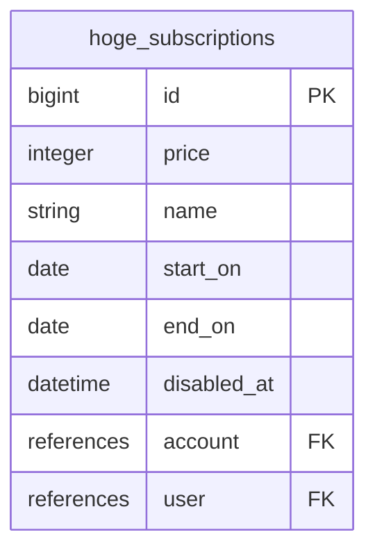

# Mergration


This gem generates migration files from markdown files.
Entity and Relations can be written in [Mermaid.js syntax](https://mermaid.js.org/syntax/entityRelationshipDiagram.html) on markdown files, and migration files will be generated by running `bin/rails generate mergration:install`.

## Installation

Add this line to your application's Gemfile:

```ruby
gem 'mergration'
```

And then execute:

    $ bundle install

Or install it yourself as:

    $ gem install mergration

## Usage

Let's say you write down ER diagram on `docs/mermaid/hoge_subscription.md` in Mermaid.js syntax, something like

```
erDiagram
  %% write some comments here
  hoge_subscriptions {
    bigint id PK
    integer price
    string name
    date start_on
    date end_on
    datetime disabled_at
    references account FK
    references user FK
  }
```




and then you can run mergration generator and migration file would be generated like:

```shell
$ bin/rails generate mergration:install
Running via Spring preloader in process 73574
      create  db/migrate/20230716192207_create_hoge_subscriptions.rb
$ cat db/migrate/20230716192207_create_hoge_subscriptions.rb
class CreateHogeSubscriptions < ActiveRecord::Migration[6.1]
  def change
    create_table :hoge_subscriptions do |t|
      t.bigint :id
      t.integer :price
      t.string :name
      t.date :start_on
      t.date :end_on
      t.datetime :disabled_at
      t.references :account, foreign_key: true
      t.references :user, foreign_key: true

      t.timestamps
    end
  end
end

```

## Current Limitations and Areas for Improvement
This section outlines the current limitations of the Mergration gem and potential areas for future improvement. Understanding these aspects can help users evaluate if the gem fits their current needs and what to expect.

### Parser and Error Handling
- The parser relies on the `kramdown-mermaid` gem. Any limitations or bugs in `kramdown-mermaid`'s parsing of Mermaid ERD syntax will directly affect Mergration.
- Current error handling during the parsing phase is minimal. If a Markdown file exists but contains malformed or unexpected Mermaid syntax not caught by `kramdown-mermaid`, the parser might fail silently or produce an incomplete internal representation, potentially leading to unexpected errors or incorrect migrations later in the process.
- *Suggestion for Improvement:* Enhance the parser to perform more sanity checks on the AST (Abstract Syntax Tree) received from `kramdown-mermaid` to detect obviously incorrect structures. Implement more verbose error reporting to help users pinpoint issues in their Mermaid diagrams.

### Migration Generation
- **Primary Key Handling**:
    - The gem currently does not support the definition of custom primary keys (e.g., composite primary keys or using a column other than `id` as the primary key) from the Mermaid diagram. The comment `currently not support PK` exists in the generator code.
    - Rails' default behavior of creating an auto-incrementing `id` column as the primary key will be applied to all generated tables.

- **Supported Attribute Options**:
    - Basic column types (string, integer, text, date, datetime, bigint, etc.) are supported.
    - Foreign Key constraints (`FK`) are translated to `references ..., foreign_key: true`.
    - Unique Key constraints (`UK`) are translated to `index: { unique: true }`.
    - However, many common Rails column options are **not** currently translatable from the Mermaid syntax, such as:
        - `null: false` / `null: true`
        - `default: <value>`
        - `limit: <size>` (for strings, text, integers)
        - Precision and scale for `decimal` types.
        - Custom index names or types (beyond a single unique constraint).

- **Relationship Support**:
    - The gem can generate `references` with foreign key constraints for direct relationships indicated by `FK` in the Mermaid diagram.
    - More complex relationships, such as many-to-many (which often require join tables) or one-to-one relationships with specific constraints, are not automatically identified and generated. Users will need to manually create migrations for these.

- **No Support for Migration Updates (Schema Evolution)**:
    - Mergration is designed to generate *new* migration files for creating tables.
    - It **does not** have the capability to detect changes in existing Mermaid diagrams and generate `change_table` migrations or other alteration migrations for existing database tables.
    - If you modify a Mermaid diagram for a table that has already been migrated, you will need to manually create a new migration to apply those changes to your database. This is a significant limitation for evolving a database schema over time using the diagrams as the source of truth.

### Testing Coverage
- **Unit Tests for Parser**:
    - There are currently no dedicated unit tests for the `Mergration::Parser` module. This means the core logic responsible for interpreting the Mermaid diagram's AST (Abstract Syntax Tree) and extracting entity/attribute information is not independently verified.

- **Generator Spec Scope**:
    - The existing tests for the migration generator (`spec/generators/install_generator_spec.rb`) are limited in scope.
    - While they verify the creation of basic migration file structures and the default `id` column, they do not cover:
        - Translation of various Mermaid data types to their corresponding Rails migration column types.
        - Correct generation of foreign key (`FK`) constraints.
        - Correct generation of unique key (`UK`) constraints.
        - Behavior when encountering invalid or unsupported data types in the Mermaid diagram (i.e., testing `Mergration::TypeError`).
        - Behavior when no Markdown files are found in the specified directory (i.e., testing `Mergration::NotFoundError`).
        - Robustness against different naming conventions or edge cases in entity names.

- **Suggestion for Improvement**:
    - Significantly expand test coverage. This should include:
        - Unit tests for the `Mergration::Parser` to ensure it correctly processes various valid and potentially invalid Mermaid structures.
        - More comprehensive generator specs that test the translation of all supported Mermaid features (data types, constraints) into the correct migration code.
        - Tests for error handling scenarios to ensure the gem behaves predictably and provides clear feedback.

### Configuration and Customization
- **Hardcoded File Path**:
    - The directory for Mermaid diagram files is currently hardcoded to `docs/mermaid/*.md`. Users who prefer a different directory structure will need to modify the gem's source code.
    - *Suggestion for Improvement:* Allow users to configure the input path, perhaps via a Rails initializer or a command-line option.

- **Fixed Naming Conventions**:
    - The gem uses built-in Rails inflections (e.g., `downcase.camelize.pluralize`) to generate table and file names based on entity names from the diagram.
    - While these generally follow Rails conventions, projects with specific or different naming strategies have no way to customize this behavior.
    - *Suggestion for Improvement:* Explore options for allowing users to provide their own inflection rules or naming strategy.

## Future Enhancements
Based on the current limitations, future versions of Mergration could be enhanced with the following features:
- Support for generating `change_table` migrations to update existing database schemas from modified Mermaid diagrams.
- Increased support for Rails column options directly from Mermaid syntax (e.g., `nullable`, `default` values, `limit`, precision/scale).
- Generation of join tables for many-to-many relationships.
- Support for defining non-unique indexes.
- Configurable input directory for Mermaid files.
- More robust error handling and reporting for invalid Mermaid syntax.
- Comprehensive test suite covering parsing, all supported generation features, and error conditions.
- Allow definition of custom primary keys.

## Development

After checking out the repo, run `bin/setup` to install dependencies. Then, run `rake spec` to run the tests. You can also run `bin/console` for an interactive prompt that will allow you to experiment.

To install this gem onto your local machine, run `bundle exec rake install`. To release a new version, update the version number in `version.rb`, and then run `bundle exec rake release`, which will create a git tag for the version, push git commits and the created tag, and push the `.gem` file to [rubygems.org](https://rubygems.org).

## Contributing

Bug reports and pull requests are welcome on GitHub at https://github.com/38tter/mergration. This project is intended to be a safe, welcoming space for collaboration, and contributors are expected to adhere to the [code of conduct](https://github.com/38tter/mergration/blob/master/CODE_OF_CONDUCT.md).

## License

The gem is available as open source under the terms of the [MIT License](https://opensource.org/licenses/MIT).

## Code of Conduct

Everyone interacting in the Mergration project's codebases, issue trackers, chat rooms and mailing lists is expected to follow the [code of conduct](https://github.com/38tter/mergration/blob/master/CODE_OF_CONDUCT.md).
